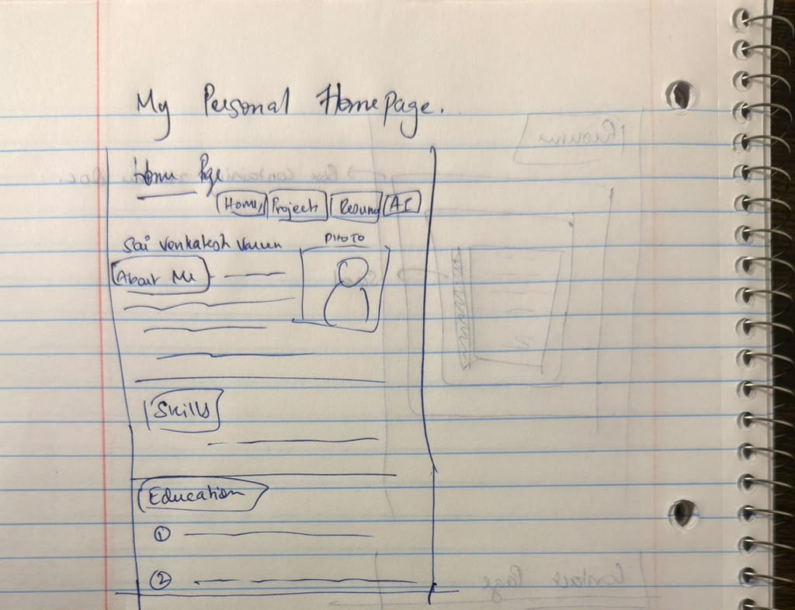
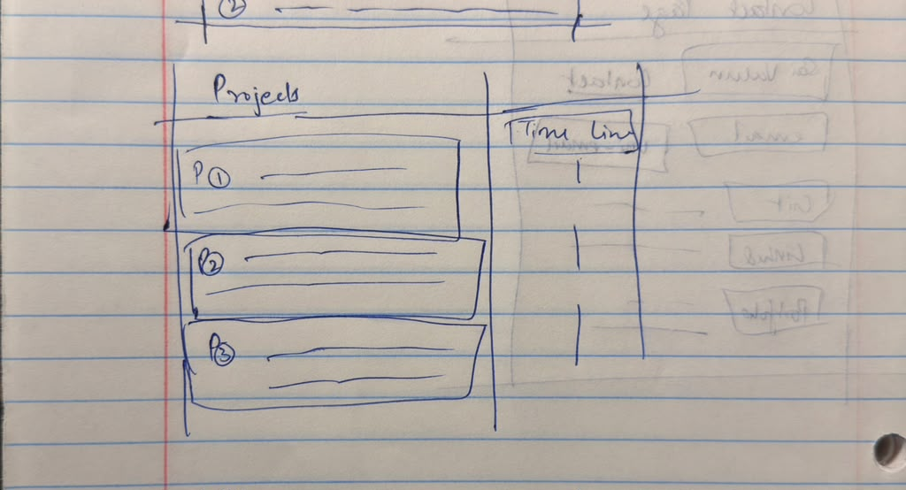
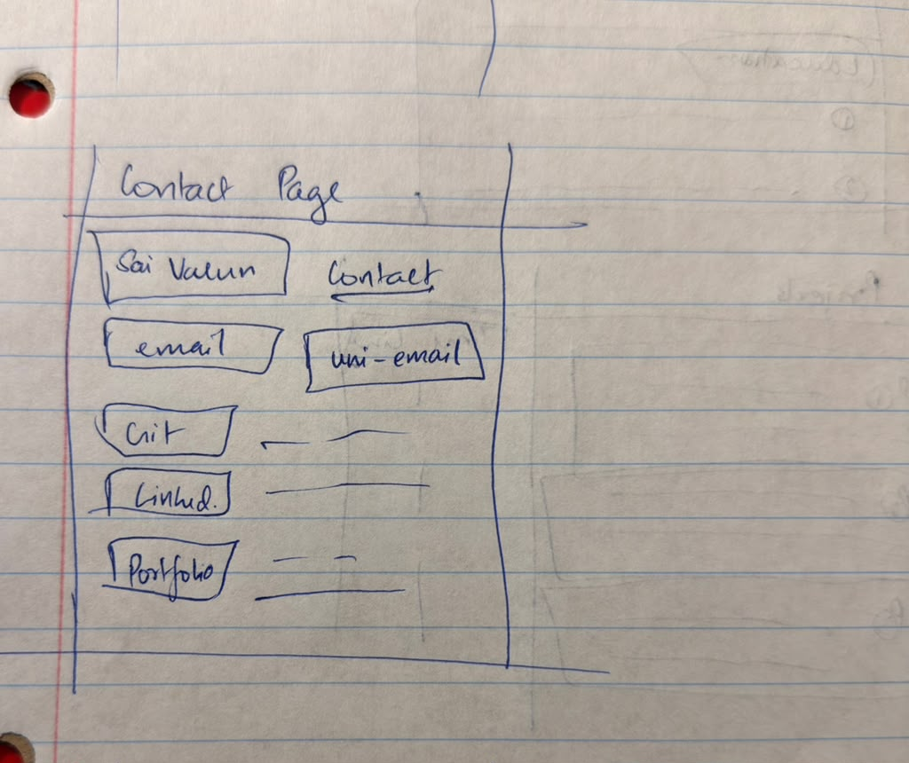

# Design Document - Personal Homepage

- **Author** Sai Venkatesh Varun Muruganandam Murali Krishnan
- **Class**  [CS5610 Web Development, Fall 2026](https://johnguerra.co/classes/webDevelopment_online_fall_2026/)
- **Website** https://varun-2103.github.io/Personal-Homepage/

## Project Description

This project is a personal homepage about myself. I'm a second year MSCS student at Northeastern University's Boston campus. In this website I will give the visitors of my page a quick introduction to me, my education, technical skills, projects, research, accomplishments and my contact information for those who would like to reach out to me.

I've decided to go with 4 pages for this project, with the relevant information in each page corresponding to the page's name, like projects, home,..etc.

The pages are:
- **Home** (index.html) gives a breif introduction to me and shows my education and the relevant skills I've gained during my educations.
- **Projects** (projects.html) will list my projects with their details and the skills I used in the project. I will have a hover function on this portion for each project to make it interactive.
- **AI- Generated Contact Page** : This will have my contact information.

The regular pages will be themed with a white theme to give a bright and proffesional look to the page. 

The AI will have a similar look as I will use my previous pages as a reference for the AI to create the page. 

## Target Users 

The main users of my website are: 
- Recruiters
- Professors
- Peers

## User Personas

### Persona 1: John, Recruiter
John is a recuiter for AI/ML based roles, who is currently reviewing student portfolios. He wants to be able to see my skills, projects and a way to contact me.

### Persona 2: Albert, Professor/Research Collaborator 
Albert is a professor at Northeastern University. He wants learn about my research background and the interests that I have so he can decide whether I'm a fit for his research.

### Persona 3: Tor, Peer
Tor is a peer from Northeastern University. He wants learn more about my background and see what kinds of projects I have worked on. He uses both his phone and personal computer to view my website.

## User Stories 

### User Story 1: John, Recruiter
As a recruiter, I would like to open the Personal Homepage and get an understanding of Varun's education and skills and decide wether he's a good fit for the role.

Requirements for Acceptance:
- The home page should have a short introduction paragraph
- Relevant Projects are listed with their technologies
- Education is clear and organised properly
- All the skills are easy to read 

### User Story 2: Albert, Professor/Research Collaborator 
As a professor, I would like to look at Varun's research projects and the software he has experience with. Would also like to know the interests he has based on his education and research trajectory.

Requirements for Acceptance:
- The home page should include a parargaph of his introduction and his interests
- Research Projects are cataloged properly and has descriptions
- Ai page shows his creativity

### User Story 3: Tor, Peer
As a peer, I would like to explore the projects Varun has done so I can learn more about his technical skills and interests.

Requirements for Acceptance:
- All pages are easily accessible
- Ui is clean and understandable
- All the projects are displayed correctly
- Contact information is mentioned 
- Website works on both phone and computer screens

## Javascript Feature
This website includes an interactive Project feature on the Projects page. It allows the visitor to filter and find my relevant projects according to the main technical domain be it ai, or desktop software and so on.

The Feature uses JS to:
- Display all projects by default.
- But when the filter is changed to AI, Data or Software it displays the corresponding project.
- When clicking on the filter, it will be highlighted.
- The project list and description will be updated on the live page.

This feature is a very helpfull tool for any visitor that wants to explore my projects based on the domain.

## Design Mockups
### Home page

This is a sketch of my homepage, this contains navigation buttons for 4 web pages, namely; Home, Projects, Resume, & Contact. The home page contains my photo, about me then my skills are listed after which my education is displayed.

### Projects Page

This is a sketch of my projects page, this contains all the projects I've done with their relevant descriptions and the the skills used along with the timeline.

### Contact page

This is a sketch of my contact page, contains my email, github link, linkedin, so the visitor can contact me.

## AI Generated Page
I've used my instructions, my home page and my ai page mockup drawings as a guideline for the ai to generate the third contact.html page. 

The prompts and my usage is mentioned in the README.md document. 

## Accesibility and Usability
- Images include `<alt>` text when needed.
- Nav links are consistent and functional in all 3 pages.
- There are interactive controls such as `<button>` and `<a>`.
- There is also html headers like `<header>, <nav>, <main>` and so on in the html files for organisation.
- Everything is easy to read and has headings for all the necessary content.

## Website Design 
- HTML5 for the page structure.
- CSS for styling, layout, spacing, responsive styling.
- ES6 JS modules.
- Prettier for formatting.
- Flexbox for alignment, navigation.
- ESlint 
- Github pages for deployment

The CSS file is in css folder, java script files in js folder, images in images folder.

## Final Summary
Before submission i will validate the page in W3C Markup Validation Service and fix any error that arises.